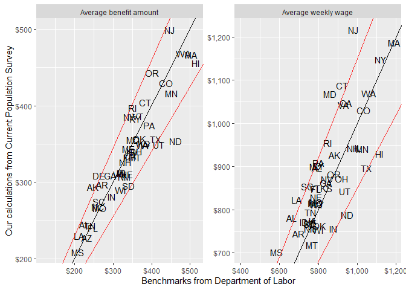

Unemployment insurance benefit calculator
================
Peter Ganong, Pascal Noel, Peter Robertson and Joseph Vavra

This code enables you to calculate the level of weekly unemployment insurance (UI) benefits for every state based on an individual's quarterly earnings history. We use this calculator in [Ganong, Noel
and Vavra (2020)](https://cpb-us-w2.wpmucdn.com/voices.uchicago.edu/dist/1/801/files/2018/08/ganong_noel_vavra_ui_replacement_rate.pdf). 

The calculator can be used from Python, R and Stata. Above, you will find minimum working examples for each language.

To install it, run:
```
pip install git+https://github.com/ganong-noel/ui_calculator.git
```

The core of the calculator is a Python function `calc_weekly_state_quarterly`. 
* Inputs: `q1_earnings, q2_earnings, q3_earnings, q4_earnings, state`
* Output: weekly benefit amount (`wba`)

### minimum working example using Current Population Survey and R

| Annual earnings | Annual weeks worked | State | 
| --- | --- | --- | 
| 1600| 8 | IN | 
| 88000| 52 | AZ | 
| 35000 | 52 | NV | 

``` r
library(reticulate) #package to call Python functions from R.
use_condaenv()
ui_calculator = import("ui_calculator")
library(tidyverse)

example %>%
  mutate(weekly_earnings = earnings/weeks_worked,
         q1_earnings = weeks_worked - 39,
         q2_earnings = weeks_worked - 26,
         q3_earnings = weeks_worked - 13,
         q4_earnings = weeks_worked) %>%  
  mutate_at(vars(matches("q[1-4]_earnings" )),
            ~ case_when(.x > 13 ~ 13*weekly_earnings,
                        .x < 0 ~ 0,
                        TRUE ~ .x*weekly_earnings)) %>%
  mutate(benefits_amount =
         ui_calculator$calc_weekly_state_quarterly(q1_earnings,
                                                   q2_earnings,
                                                   q3_earnings,
                                                   q4_earnings,
                                                   state) %>% map_dbl(1))
```

| Annual earnings | Annual weeks worked | State | Weekly benefits |
| --- | --- | --- | --- | 
| 1600| 8 | IN | 0
| 88000| 52 | AZ | 240
| 35000 | 52 | NV | 350

The worker in Indiana does not meet the eligibility requirements so receives 0. The worker in Arizona recieves the maximum benefit amount of 240. The worker in Nevada recieves 1/25th of their highest quarter wage, which we calculate to be $350.

The `calc_weekly_state_quarterly` returns benefits as a list, so you may find it helpful to combine the function with another function which converts a list of numerics to a vector e.g. `purrr::map_dbl(x, 1)`, `purrr::flatten_dbl(x)` or `unlist(x)`.

### Comparison of estimated benefits from calculator to actual benefits

<!-- -->

Benchmarks source: Unemployment Insurance Benefit Accuracy Measurement data

### Calculator Details

The calculator computes the benefits of a worker without dependendents as of January 2020. It also can be used to simulate alternative policies, such as Federal Pandemic Unemployment Compensation.

Many states have complex UI benefit rules. We follow the rules described in ["Significant Provisions of State Unemployment Laws"](https://oui.doleta.gov/unemploy/content/sigpros/2020-2029/January2020.pdf). If a state has multiple ways of satisfying eligibility or multiple ways of calculating benefits, we include only the first listed way. This document, and therefore our calculator, do not capture every aspect of a state's UI rules. A dictionary of the features used by the calculator can be found in [`data_dict.md`](data_dict.md). 


### Acknowledgements
If you find a problem, please open a github issue or even better propose a fix using a pull request. 

Thank you to Maya Sweedler for helpful feedback.

### License
This program is free software: you can redistribute it and/or modify it under the terms of the GNU General Public License as published by the Free Software Foundation, either version 3 of the License, or (at your option) any later version.

This program is distributed in the hope that it will be useful, but WITHOUT ANY WARRANTY; without even the implied warranty of MERCHANTABILITY or FITNESS FOR A PARTICULAR PURPOSE.  See the GNU General Public License for more details.
